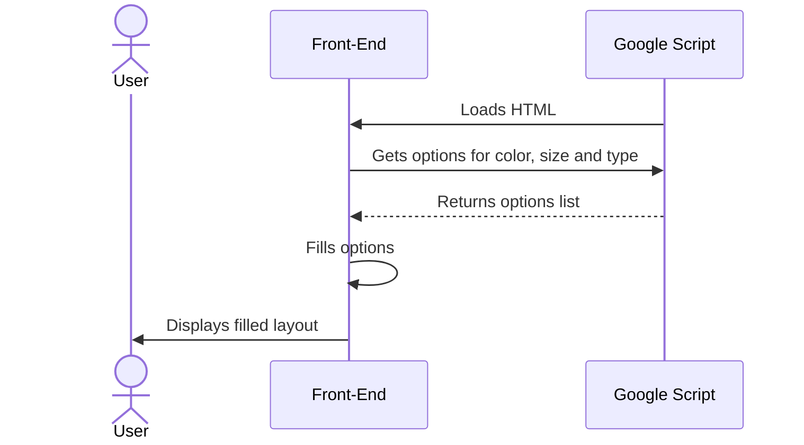
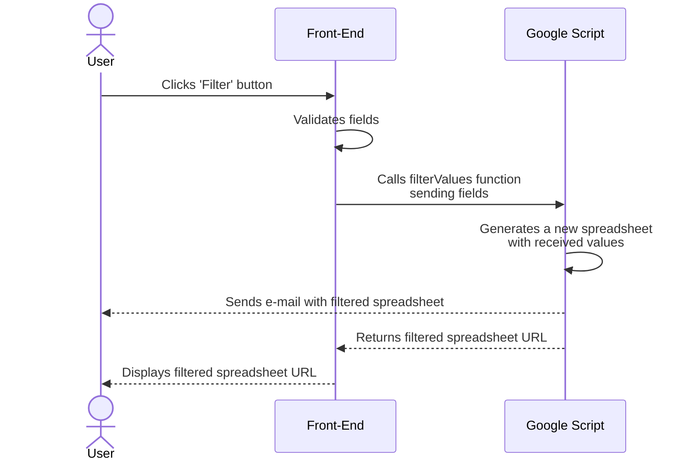

# Product Spreadsheet Filtering and Reporting

This Google Apps Script project is designed to filter data in a [Products Spreadsheet](https://docs.google.com/spreadsheets/d/1y7kVZzz3KfwrkL0M9ZfEwbH5fRKFgl5zZcphqIzsiBE/edit?usp=sharing) based on user-defined criteria. It generates a new spreadsheet with the filtered results and, optionally, sends an email to a specified address containing the link to the filtered spreadsheet and the chosen filters. The project's functionalities include:
 - Dynamic data filtering
 - New spreadsheet generation
 - Email reporting 
 - Integration with Google Sheets

You can try out the deployed version using [this link](https://script.google.com/macros/s/AKfycbz1udj5gtmMFt8ToKRgGWON5VI5sAxWnOBYdF0YkAkDzO1FGIgD77Me-cflziDB1dXiyQ/exec). 

To make changes and deploy a new version of the project, you can follow the step-by-step instructions in the project setup section. 

[Project overview](#project-overview)<br>
[Project setup](#project-setup)<br>
[Demonstration video](#demonstration-video)<br>

## Project overview

### Load layout diagram



### Generate spreadsheet and send e-mail diagram



## Project setup

### Environment variables
The object columnsMap is used to set the column for each category to be filtered. The value for each key is, respectively, the index of that column in the spreadsheet.

```
>>/code/Code.gs

const columnsMap = {
    "productType": 4, // 'E' in spreadsheet
    "price": 8, // 'I' in spreadsheet
    "color": 13, // 'N' in spreadsheet
    "size": 14 // 'O' in spreadsheet
}
```
Example: The first column from left to right (labeled 'A') has the value 0.

### Style

Both bootstrap and internal CSS were used to style the project. To use bootstrap, the style and script links were added:
```
>>/code/index.html

<head>
    ...
    <link href="https://cdn.jsdelivr.net/npm/bootstrap@5.3.2/dist/css/bootstrap.min.css" rel="stylesheet">
    ...
</head>
<body>
    ...
    <script src="https://cdn.jsdelivr.net/npm/bootstrap@5.3.2/dist/js/bootstrap.bundle.min.js"></script>
    ...
</body>
```

### Deployment 

This project was designed to be applied to a copy of the original products spreadsheet. To apply it, you can use the [same copy](https://docs.google.com/spreadsheets/d/1y7kVZzz3KfwrkL0M9ZfEwbH5fRKFgl5zZcphqIzsiBE/edit?usp=sharing) used in the deployed version or, alternatively, create a copy of your own from the [original spreadsheet](https://docs.google.com/spreadsheets/d/1qxylX_QdyANzRudKQsRXtD06BiLleM99PQjgYl_Vg7s/edit?usp=sharing).

To deploy it using Google Apps Scripts, you can follow the bellow step-by-step:
1. Open Your Google Spreadsheet.
2. Open Apps Script Editor:<br>
<t>Go to Extensions > Apps Script.
3. Copy and Paste the Script:<br>
<t>Replace the default Google Script file content with the script (/code/Code.gs).<br>
<t>Create a new index.html file and fill the content with the HTML (/code/index.html).
4. Save the Script.
5. Authorize the Script.

Run the script once to authorize it to access your Google Sheets, Gmail, and other required services.

For further help, you can also watch the setup video:<br>
[](video-link)

## Demonstration video
[](video-link)
